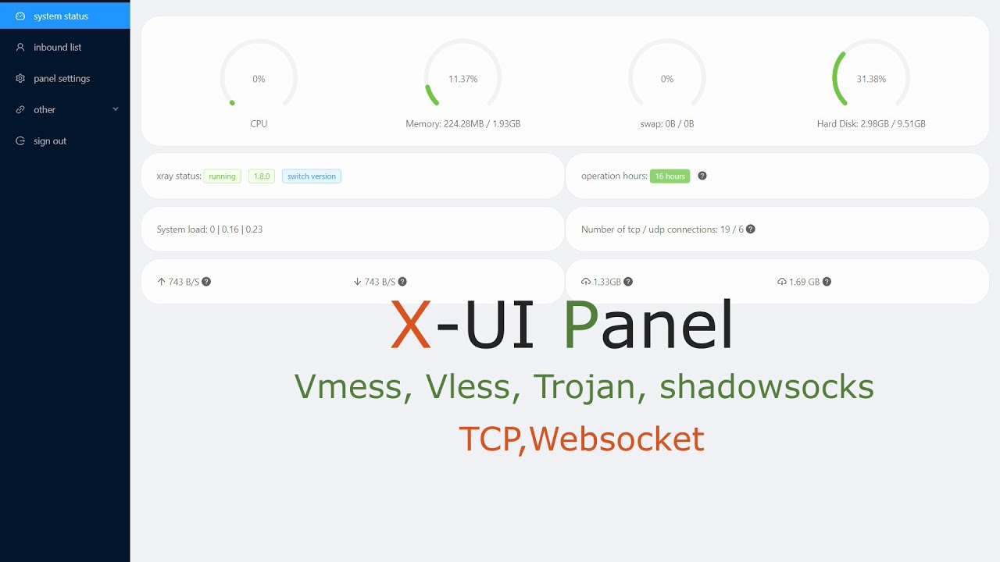

# x-ui

I'll explain how to set up the popular **v2ray** platform to bypass *almost* any [GFW](https://en.wikipedia.org/wiki/Great_Firewall) like a knife through butter. If you like the project and found it helpful, please star the project and share it with others!

<p align="center">
  
</p>

> **Note**
> The following instructions require some technical background on Linux, Docker, Certificates, and some concepts about networking and VPNs in general. If you have any questions or suggestions, feel free to open an [Issue](https://github.com/keivanipchihagh/x-ui/issues/new) or a Pull request.

## Table of Contents
- 💫 [Requirements](https://github.com/keivanipchihagh/x-ui#-requirements)
- 🪖 [(optional) Safety first](https://github.com/keivanipchihagh/x-ui#-optional-safety-first)
- 🐳 [Docker second](https://github.com/keivanipchihagh/x-ui#-docker-second)
- 🚀 [Rise and shine: X-UI](https://github.com/keivanipchihagh/x-ui#-rise-and-shine-x-ui)
- 🗝️ [TLS Encryption](https://github.com/keivanipchihagh/x-ui#-tls-encryption)
- 📬 [Adding Inbounds](https://github.com/keivanipchihagh/x-ui#-adding-inbounds)
- 👻 [IPv6 is here to help](https://github.com/keivanipchihagh/x-ui#-ipv6-is-here-to-help)
- 🚆 [(optional) Tunnel your way through](https://github.com/keivanipchihagh/x-ui#%EF%B8%8F-optional-tunnel-your-way-through)
- 🚤 [Speeding up TCPs](https://github.com/keivanipchihagh/x-ui#-speeding-up-tcps)
- 🧱 [Hide behind CDN](https://github.com/keivanipchihagh/x-ui#-hide-behind-cdn)
- ⚒️ [Cloudflare's alternative for CDNs](https://github.com/keivanipchihagh/x-ui#%EF%B8%8F-cloudflares-alternative-for-cdns)
- 🎗️ [Simple Routing](https://github.com/keivanipchihagh/x-ui#-simple-routing)
- 🤝 [Issues and Contributions](https://github.com/keivanipchihagh/x-ui#-issues-and-contributions)
- 📖 [Credits](https://github.com/keivanipchihagh/x-ui#-credits)
- 🍩 [Donate](https://github.com/keivanipchihagh/x-ui#-donate)


## 1. 💫 Requirements
First things first, you need a [domain](https://en.wikipedia.org/wiki/Domain_name) and a [VPS](https://en.wikipedia.org/wiki/Virtual_private_server). It doesn't matter what [TLD](https://en.wikipedia.org/wiki/Top-level_domain) you go for as long as it's not a `.ir` obviously, but feel free to checkout the popular TLDs to find one that matches your style. For your VPS, I always get mine from [pulseheberg](https://pulseheberg.com/en/), because not only they have the best prices, but also cryptocurrency payment method.

Once you got yourself a domain and server, Create a [Cloudflare](https://cloudflare.com/) account and register them both. It may take a few hours for your chances to settle it. Once done, map a subdomain to your server [IPv4](https://en.wikipedia.org/wiki/IPv4) (Leave proxied *unchecked* for now). This can take a few minutes to take effect and you can check it's availablity with a tool like [dnschecker](https://dnschecker.org/).

## 2. 🪖 (optional) Safety first
I always enjoy the extra security on my servers. If you do too, then run the [`scripts/ufw.sh`](scripts/ufw.sh) to enable your firewall with default policies and add the ports we need for our work.
- Port *54321*: Default dashboard's UI
- Port *2053*: V2ray's inbound port

## 3. 🐳 Docker second
[Docker](https://www.docker.com/) is the perfect tool for our job since it's clean and easy to deploy stuff with. If you don't have it already, running the [`scripts/docker.sh`](scripts/docker.sh) script will take care of it for you.


## 4. 🚀 Rise and shine: X-UI
1. There is a template file [`.env.template`](.env.template) which contains placeholders for variables that you have to change accordingly. When you are done editing, rename the file to `.env`.

2. Make sure nothing is blocking ports **80** and **443** (specially [NGINX](https://nginx.org/en/)) for now. If there is any process using it at the time, stop it temporarily.

3. Run the [`build.sh`](build.sh) script which will deploy two containers. One for the X-UI dashboard and the second to create a SSL certificate using [CertBot](https://certbot.eff.org/).

4. All done! Access your dashboard via `<SERVER-IP>:<DASHBOARD-PORT:-54321>` and with default username/password as `admin`.

## 5. 🗝️ TLS Encryption
Connecting to your server with the old-fashioned [HTTP](https://en.wikipedia.org/wiki/HTTP) protocol or creating a VPN without any TLS encryption will leave your exposed to the outside world. Here is how to fix it:

1. On your [Cloudflare](https://cloudflare.com/) account, set the *SSL/TLS* level to `strict` or beyond.

2. Navigate to **Panel Settings** and change the following fields:
    - Panel *certificate.crt* file path: `/etc/letsencrypt/live/{DOMAIN}/fullchain.pem`
    - Panel *private.key* file path: `/etc/letsencrypt/live/{DOMAIN}/privkey.pem`

From now on, access your dashboard via `<DOMAIN>:<DASHBOARD-PORT>` which is highly recommended.

## 6. 📬 Adding Inbounds
There are many inbound combinations, configurations, and protocols you can use here. I would suggest the following configurations because it will give us better performance and security:
- Remark: `vmess-ws-tls`
- Protocol: `vmess`
- Port: `2053`
- Disable insecure encryption: `True`
- Transmission: `ws`
- TLS: `True`
- *certificate.crt* file path: `/etc/letsencrypt/live/{DOMAIN}/fullchain.pem`
- *private.key* file path: `/etc/letsencrypt/live/{DOMAIN}/privkey.pem`
- Sniffing: `True`

The following onfiguration can be faster under certain circumstances. Add the following as your second inbound:
- Remark: `trojan-tcp-xtls`
- Protocol: `Trojan`
- Port: `443`
- Disable insecure encryption: `True`
- Transmission: `TCP`
- xtls: `True`
- *certificate.crt* file path: `/etc/letsencrypt/live/{DOMAIN}/fullchain.pem`
- *private.key* file path: `/etc/letsencrypt/live/{DOMAIN}/privkey.pem`
- Sniffing: `True`

Each of the above inbounds have their own merits and drawbacks. Feel free to play with different combinations to find the one that suites your needs best.

## 7. 👻 IPv6 is here to help
As of now, not all [ISP](https://fr.wikipedia.org/wiki/ISP)s support IPv6, and thus this may not work for some. But we will configure it in a way to prefer IPv6 if available.

1. You need three pieces: `PUBLIC_IPV6_GATEWAY`, `PUBLIC_IPV6_ADDRESS` and `IPV6_NAMESERVERS`
2. Configure your server's IPv6 address to point to your domain on your Cloudflare.
3. Modify `/etc/netplan/50-cloud-init.yaml` to enable IPv6 on your VPS:
```yaml
network:
    version: 2
    ethernets:
        eth0:
            addresses:
            - PUBLIC_IPV4_ADDRESS/20
            - 10.48.0.9/16
            - PUBLIC_IPV6_ADDRESS/64
            match:
                macaddress: <HIDDEN>
            mtu: 1500
            nameservers:
                addresses:
                - <HIDDEN>
                - <HIDDEN>
                - IPV6_NAMESERVERS_1
                - IPV6_NAMESERVERS_2
                search: []
            routes:
            -   to: 0.0.0.0/0
                via: PUBLIC_IPV4_GATEWAY
            -   to: PUBLIC_IPV6_GATEWAY
                scope: link
            set-name: eth0
```

> [!CAUTION]
> Pay extra attention to the routes ordering. IPv4 comes first as IPv6 is not supported on all ISPs and should not be set as your primary route.

## 8. 🚆 (optional) Tunnel your way through
[Tunneling](https://traefik.io/glossary/network-tunneling/) is a clever way to bypass GFWs and may give you higher speed at a cost of a second VPS server. The idea is to not directly connect to your "upstream server" anymore, but to connect to an intermediate server that we call a "bridge server". This server acts as a tunnel for your traffic and it placed inside a big known data center in your own country.

Here is how to do it:
1. Set up a new VPS server that is located within a data center in your own country. The process is like before, but with a new `DOMAIN`.
 (Use a new `<DOMAIN>`)
2. I would suggest the `vmess-ws-tls` combination for your upstream server.
3. Replace the configurations from [`scripts/bridge-server.json`](scripts/bridge-server.json) on your bridge serve, and [`scripts/upstream-server.json`](scripts/upstream-server.json) on your upstream server with the existing `XRAY Configuration`. You may have to Change specific parts according to your upstream inbound.

## 9. 🚤 Speeding up TCPs
Google's upgraded congestion control algorithms will slightly improve your *TCP* connection speed. To apply it to your system, run the [`scripts/bbr.sh`](scripts/bbr.sh) script.

## 10. 🧱 Hide behind CDN
If you have made it so far, you are almost done. Your VPN works perfectly fine by now, but your server IP is still exposed and can still get blocked. One genius idea is to move your `DOMAIN` behind [CDN](https://en.wikipedia.org/wiki/Content_delivery_network) to make it almost impossible to get to your server IP address. No GFW will dare to block Cloudflare CDNs as they serve tens of millions of websites all over the world.

> [!IMPORTANT]
> Make sure your VPS is working fine before continuing to this step.

1. On Cloudflare, enable *Strict SSL/TLS*.
2. For your inbound to work behind a CDN, it should be of transmission type `ws`. I would suggest the `vmess-ws-tls` combination.
3. On Cloudflare, turn on proxied for both IPv4 and IPv6.
4. Ping your `<DOMAIN>` and see if the IP changes to something other than your VPS IP. This can take a few minutes to hours.

## 11. ⚒️ Cloudflare's alternative for CDNs
CDNs are great, they really are, but [Cloudflare Workers](https://workers.cloudflare.com/) are the new and scalable Cloudflare's solution to replace the CDNs. Here is how to set it up:

1. Create a worker from [Cloudflare](https://workers.cloudflare.com/).
2. Copy and modify the script [`scripts/worker.js`](scripts/worker.js) to your worker and deploy it.
3. Optionally, to get rid of initial your Cloudflare worker address, connect your Worker to a custom domain (Can take a few minutes to hours to take effect).
4. Modify your client config by replacing the `address`, `SNI`, and `request host` with your worker address and your port to **443**.

> [!NOTE]
> Cloudflare workers support more ports (80, 443, 2052, 2053, 2082, 2083, 2086, 2087, 2095, 2096, 8080, 8443, 8880) that you can use to forward your traffic to X-UI (remember could only use *443* for CDN). I used *2053* for this guide.

## 12. 🎗️ Simple Routing
It's probably not a good idea to pass all the traffic throught a VPN. Instead, you can use the [Routing](https://www.v2fly.org/config/routing.html#ruleobject) feature to filter the ones you want to pass through. Go to `program` -> `preferences` -> `Routing Settings` -> `Custom` and add the following rule:
```json
{
    "rules": [
        {
            "domain": [
                "regexp:.*\.ir(/|$).*"
            ],
            "outboundTag": "direct",
            "type": "field"
        }
    ]
}
```
You can also use the *Simple Routing* feature of Nekoray to add handpicked domains or IPs to your routing settings.

## 🤝 Issues and Contributions
Feel free to ask questions via [issue](https://github.com/keivanipchihagh/xui-trojan/issues/new) or add your creative ideas by opening a [pull request](https://github.com/keivanipchihagh/xui-trojan/pulls).

## 📖 Credits
- [BBR Script](https://github.com/teddysun/across) - The script that makes TCP go kaboom
- [X-UI Image](https://hub.docker.com/r/enwaiax/x-ui) - The English version of the X-UI Image
- [iran-hosted-domains](https://github.com/bootmortis/iran-hosted-domains/blob/main/README.fa.md) - V2ray routing guide

## 🍩 Donate
Support me on developing this repository.
